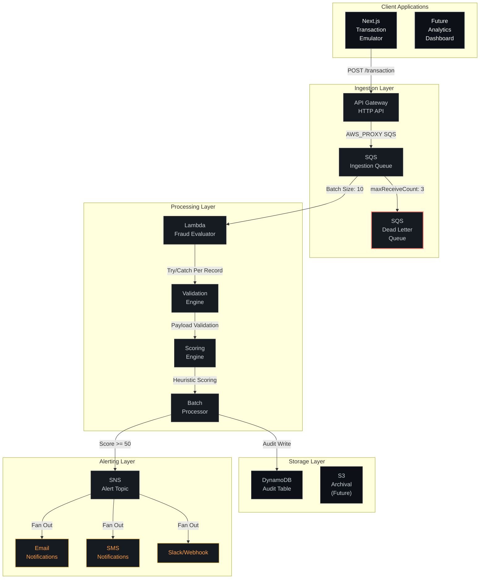

# SentryNode Fraud Engine


## 🏦 Real-Time Fraud Detection MVP

A production-ready, event-driven, serverless fraud detection system built to run entirely within AWS Free Tier limits. The system processes financial transactions in real-time, applies heuristic-based risk scoring, and alerts stakeholders when suspicious activity is detected.

### 🏗️ System Architecture



### 📁 Repository Structure

```
sentrynode-fraud-engine-fab-v2/
├── .github/                # CI/CD workflows, PR/issue templates
├── docs/                   # Architecture diagrams, design decisions
├── infra/                  # AWS SAM/CloudFormation templates
│   ├── template.yaml       # Infrastructure as Code
│   └── events/             # Sample events for local testing
├── lambda/                 # Python fraud evaluation logic
│   ├── fraud_evaluator.py  # Main Lambda handler
│   ├── tests/              # Unit tests
│   └── requirements.txt    # Python dependencies
├── frontend/               # Next.js console application
│   ├── app/                # App Router pages
│   ├── components/         # Reusable UI components
│   └── lib/                # API clients, types, utilities
├── README.md               # This file
├── CONTRIBUTING.md         # Development guidelines
└── AGENTS.md               # AI agent usage guidelines
```

### 🚀 Quick Start

#### Prerequisites
- [AWS CLI](https://aws.amazon.com/cli/) configured with appropriate permissions
- [AWS SAM CLI](https://docs.aws.amazon.com/serverless-application-model/latest/developerguide/install-sam-cli.html)
- [Node.js](https://nodejs.org/) >= 18
- [Python](https://www.python.org/) >= 3.12
- [npm](https://www.npmjs.com/) or [yarn](https://yarnpkg.com/)

#### 1. Deploy Backend Infrastructure
```bash
cd infra
sam validate --lint          # Validate template (optional but recommended)
sam build                    # Build Lambda dependencies
sam deploy --guided          # Deploy with guided prompts
```
> **Note:** You'll be prompted for:
> - `AlertEmail`: Email address for fraud alerts
> - `AllowedOrigin`: CORS origin for frontend (e.g., http://localhost:3000)

After deployment, **check your email and confirm the SNS subscription** - alerts won't arrive until confirmed.

#### 2. Run Backend Tests
```bash
cd lambda
pip install -r requirements.txt pytest --break-system-packages
AWS_DEFAULT_REGION=us-east-1 python -m pytest tests/ -v
```

#### 3. Start Frontend Application
```bash
cd frontend
npm install
cp .env.example .env.local     # Copy and edit environment variables
```
Edit `.env.local` to add:
```
NEXT_PUBLIC_INGESTION_API_URL=https://your-api-gateway-url.execute-api.region.amazonaws.com/Prod
```

Then start the development server:
```bash
npm run dev
```
Visit [http://localhost:3000](http://localhost:3000) to access the Transaction Emulator.

#### 4. Test the System
1. Use the Transaction Emulator tab to submit test transactions
2. Watch the risk meter update in real-time as you type
3. Submit transactions ≥ $10,000 or from high-risk countries (KP, IR, SY, CU) to trigger alerts
4. Check your email for SNS notifications
5. View raw transaction logs in AWS DynamoDB console (table: `sentrynode-audit-log`)

### 🔧 Development Workflow

#### Making Changes
1. **Create a feature branch**: `git checkout -b feat/your-feature-name`
2. **Implement changes** following the [contributing guidelines](CONTRIBUTING.md)
3. **Run tests** for affected components:
   - Backend: `cd lambda && pytest`
   - Infrastructure: `sam validate && sam build`
   - Frontend: `npm run lint && npm test` (when tests are added)
4. **Deploy changes**: `cd infra && sam deploy`
5. **Open Pull Request** against `main` branch

#### Critical Development Rule
⚠️ **Shared Contract Awareness**: The transaction payload shape (`cardholder_name`, `amount`, `ip_address`, `country_code`) is used across three layers:
- `infra/template.yaml` (API Gateway → SQS passthrough)
- `lambda/fraud_evaluator.py` (validation & scoring)
- `frontend/lib/types.ts` + `frontend/app/emulator/page.tsx` (form & preview)

**ANY change to this shape MUST update all three locations in the same PR.**

### 🧪 Testing Strategy

#### Unit Tests
- Located in `lambda/tests/test_fraud_evaluator.py`
- Cover validation logic, scoring boundaries, and batch processing
- Run with: `AWS_DEFAULT_REGION=us-east-1 python -m pytest tests/ -v`

#### Integration Testing
- Test end-to-end flow using `sam local invoke` with sample events:
  ```bash
  cd infra
  sam local invoke FraudEvaluatorFunction --event events/sample-sqs-event.json
  ```

#### Manual Testing
1. Deploy backend changes
2. Update frontend `.env.local` with new API URL
3. Use Transaction Emulator to submit test transactions
4. Verify alerts in email and audit records in DynamoDB

### 📊 Monitoring & Observability

#### Built-in Monitoring
- **CloudWatch Logs**: Lambda execution logs (retention: 3 days)
- **SQS Metrics**: Queue depth, message throughput, DLQ Messages
- **DynamoDB Metrics**: Request throughput, throttling, storage usage
- **SNS Metrics**: Publish success/failure rates

#### Alerting
- SNS notifications for high-risk transactions (configurable thresholds)
- Dead Letter Queue for failed message processing
- CloudWatch alarms can be added for production deployment

### 🔒 Security Features

#### Principle of Least Privilege
- API Gateway → SQS: Role restricted to `sqs:SendMessage` on specific queue
- Lambda Execution Role: Only `dynamodb:PutItem` and `sns:Publish` on specific resources
- No wildcard permissions or administrative access

#### Data Protection
- No hardcoded credentials or secrets
- All AWS access via IAM roles
- CORS restricted to explicit origins
- Input validation at service boundary (Lambda)

#### Compliance Considerations
- Designed for PCI-DSS scope reduction (no card data stored)
- Audit trail maintained in DynamoDB
- Tamper-evident logging through immutable event flow

### 📈 Performance & Cost Optimization

#### Free Tier Optimized
| Service | Free Tier Allocation | Usage Pattern |
|---------|---------------------|---------------|
| Lambda | 1M requests, 400k GB-sec | Bursty, event-driven |
| API Gateway (HTTP) | 1M requests | Matches Lambda invocations |
| SQS | 1M requests | Matches API Gateway traffic |
| DynamoDB | 25GB storage, 25 WCU/RCU | On-demand pricing |
| SNS | 1M publishes, 100k email/SMS | Alert volume dependent |

#### Performance Characteristics
- **Latency**: <200ms end-to-end for typical transactions
- **Throughput**: Limited by SQS batch processing (10 messages/second per Lambda concurrency)
- **Scalability**: Automatic scaling via Lambda concurrency limits
- **Reliability**: Built-in retry mechanisms and dead letter queuing

### 📚 Documentation

- [Architecture Overview](docs/architecture.md) - Detailed data flow and design decisions
- [Infrastructure README](infra/README.md) - SAM template specifics and deployment guide
- [Lambda README](lambda/README.md) - Fraud scoring logic and testing guide
- [Frontend README](frontend/README.md) - Next.js application details and UI/UX guide
- [Contributing Guidelines](CONTRIBUTING.md) - Branching, PR process, and contract rules
- [Decision Log](docs/decisions.md) - Architectural decisions and trade-offs
- [AI Agent Guidelines](AGENTS.md) - Effective use of AI agents with this codebase

### 🤝 Contributing

We welcome contributions! Please see our [Contributing Guide](CONTRIBUTING.md) for details on:
- [Branch naming conventions](CONTRIBUTING.md#branch-naming)
- [Pull request process](CONTRIBUTING.md#pr-process)
- [The critical shared-contract rule](CONTRIBUTING.md#the-shared-contract-rule)
- [Development setup](CONTRIBUTING.md#development-setup)
- [Code review checklist](CONTRIBUTING.md#pr-securitycontract-checklist)

### 📜 License

This project is licensed under the MIT License.

### 🙏 Acknowledgments

- AWS Serverless Application Model (SAM) team
- Next.js and React communities
- Open-source fraud detection research
- All contributors who help improve this project

---

<div align="center">
  <sub>Built with ❤️ for fighting financial fraud</sub>
</div>