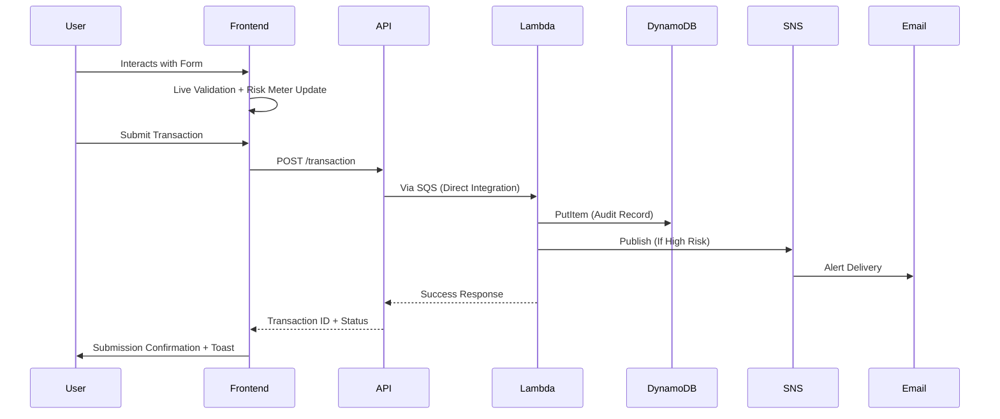

# 💻 frontend/ - Next.js Fraud Console


## 💰 Transaction Emulator & Monitoring Console

A beautifully designed, dark-mode-first Next.js 14 application serving as the operator console for the SentryNode Fraud Engine. Features a real-time Transaction Emulator for testing the fraud detection pipeline and a Monitoring Feed for reviewing transaction outcomes.

### 📦 What's Inside

**📁 `/app/`** - Next.js 14 App Router
- `/app/page.tsx` - Landing dashboard with pipeline overview
- `/app/emulator/page.tsx` - Transaction Emulator form with live risk preview
- `/app/monitoring/page.tsx` - Audit table view (shows honest "not connected" state until read API implemented)

**📁 `/components/`** - Reusable UI components
- `/components/RiskMeter.tsx` - Signature radar-sweep risk dial with ambient animation
- `/components/Nav.tsx` - Shared top navigation with responsive design
- `/components/TransactionForm.tsx` - Reusable form for transaction submission
- `/components/StatusPill.tsx` - Color-coded status indicators for risk levels

**📁 `/lib/`** - Utilities and API clients
- `/lib/api.ts` - Centralized API client (`fetchTransaction`, `fetchAuditFeed`)
- `/lib/types.ts` - Shared TypeScript interfaces (`TransactionPayload`, `AuditRecord`)
- `/lib/utils.ts` - Helper functions (formatting, validation, etc.)

**📁 `/styles/`** - Global styling and design tokens
- `/app/globals.css` - Global CSS including Tailwind base and custom utilities
- Design system foundation for consistent theming

### 🎨 Design System & Visual Language

#### 🎯 Core Philosophy
**Dark-mode-first, premium fintech-SaaS aesthetic** - designed to feel like a professional financial monitoring tool rather than a generic template.

#### 🎨 Color Semantics
| Purpose | Variable | Usage | Meaning |
|---------|----------|-------|---------|
| **Background** | `bg-zinc-950` | Page background | Deep, immersive foundation |
| **Card Surface** | `bg-zinc-900/50 border-zinc-800` | Cards, panels, list rows | Layered, tactile surfaces |
| **Primary Text** | `text-zinc-50` / `text-zinc-100` | Headings, values | High contrast readability |
| **Secondary Text** | `text-zinc-400` / `text-zinc-500` | Body copy, captions | Subdued supporting information |
| **Accent** | `indigo-500` / `indigo-400` | Primary buttons, focus rings | Brand action and interactivity |
| **Safe/Low Risk** | `bg-emerald-500/10 text-emerald-400 border-emerald-500/20` | Status indicators | Legitimate, low concern |
| **Watch/Medium Risk** | `bg-amber-500/10 text-amber-400 border-amber-500/20` | Status indicators | Elevated attention warranted |
| **High Risk** | `bg-red-500/10 text-red-400 border-red-500/20` | Status indicators | Likely fraudulent - action required |

#### 💅 Typography System
- **Header**: Geometric display face (system font) for instrumentation feel
- **Body**: Neutral sans-serif for readability
- **Data**: Monospace face for all financial data (amounts, scores, IDs)
  > *Deliberate choice - reads as instrumentation, not prose*

#### ✨ Motion & Interaction
- **Risk Meter Signature**: Slow-rotating radar sweep with ambient texture
- **Reduced Motion Support**: Animations pause when `prefers-reduced-motion` is set
- **Interactive States**: All elements use `transition-all duration-200` for consistent hover/focus
- **Feedback Loops**: Immediate visual validation during form interaction

### 🛠️ Development Experience

#### ⚙️ Local Setup
```bash
cd frontend

# Install dependencies
npm install

# Environment configuration
cp .env.example .env.local

# Edit .env.local - REQUIRED:
# NEXT_PUBLIC_INGESTION_API_URL=<your-api-gateway-url-from-infra-deploy>

# Start development server
npm run dev

# Visit http://localhost:3000
```

#### 🏗️ Production Build
```bash
# Create optimized static export
npm run build

# Output located in ./out/
# Deploy to: Vercel, Netlify, AWS Amplify, S3+Cloudflare, or any static host
```

#### 🔍 Code Quality
```bash
# Linting
npm run lint

# Type checking (when implemented)
# npx tsc --noEmit

# Formatting
npm run format  # when configured
```

#### 🧪 Testing Strategy
*Current state: Visual and manual testing focused. Future phases will add:*
- Component testing with React Testing Library
- End-to-end testing with Playwright or Cypress
- Visual regression testing with Percy or Chromatic
- Jest unit tests for utility functions

### 🖥️ User Interface Walkthrough

#### 🏠 Landing Dashboard (`/`)
Purpose: System overview and quick navigation
- **Pipeline Status Indicator**: Visual representation of data flow health
- **Quick Stats**: Transaction volume, alert counts, system uptime
- **Recent Activity**: Mini-feed of latest processed transactions
- **Navigation Links**: Direct access to Emulator and Monitoring sections

#### 🧪 Transaction Emulator (`/emulator`)
Purpose: Generate and submit test transactions through the real detection pipeline
- **Interactive Form**: Real-time field validation with helpful tooltips
- **Live Risk Meter**: Signature radar dial that updates as you type
  - **Ambient Sweep**: Continuous rotation indicating "always watching"
  - **Dynamic Fill**: Color and level update with calculated risk score
  - **Pulse Feedback**: Distinct animation when score crosses into high-risk territory
- **Field-specific Help**: 
  - Amount: Format examples and risk threshold info
  - Country Code: ISO 3166-1 alpha-2 with risk region highlighting
  - IP Address: Validation feedback and private range detection
- **Submit Button**: Disabled until form is valid, shows processing state
- **Result Toast**: Temporary notification showing transaction ID and risk outcome

#### 👁️ Monitoring Feed (`/monitoring`)
Purpose: Review processed transaction outcomes (current Phase 1 limitation)
- **Honest State Indicator**: Clearly displays "Not connected to backend" 
  > *Reflects the intentional absence of a read API in Phase 1*
- **Future-Ready UI**: Table skeleton prepared for when read API is implemented
- **Column Structure**: 
  - Transaction ID | Timestamp | Amount | Country | IP | Score | Status | Actions
- **Interactivity Planned**: Row expansion for details, filtering, export capabilities

### 🔬 Technical Implementation

#### ⚛️ Architecture Highlights
- **App Router**: Leveraging Next.js 14's latest routing and server components
- **TypeScript**: End-to-end type safety from API to UI
- **API Centralization**: All backend communication through `/lib/api.ts`
- **Contract Safety**: Shared types with lambda/ via `lib/types.ts`
- **State Management**: React hooks for form state, SWR React Query consideration for future data fetching
- **Performance**: Automatic code splitting, optimized images, minimal client-side JS

#### 🔄 Data Flow


#### 📡 API Communication
- **Single Source of Truth**: All backend calls through `lib/api.ts`
- **Environment Configuration**: `NEXT_PUBLIC_INGESTION_API_URL` from infra deployment
- **Error Handling**: Consistent error types with user-friendly messages
- **Loading States**: Skeletons and spinners for async operations
- **Retry Logic**: Configurable retry mechanisms for transient failures

#### ♻️ Component Composition Patterns
- **RiskMeter**: Compound component with separate visual and logic layers
- **TransactionForm**: Controlled components with validation lifting
- **Nav**: Responsive design with mobile-first breakpoint strategy
- **StatusPill**: Presentational component receiving risk level as prop

### 🧩 Shared Contracts & Integration Points

#### 🔗 Critical Integration: Transaction Payload Shape
This frontend consumes and produces the **exact same transaction shape** as the backend Lambda:

```typescript
// Defined in lib/types.ts, used by:
// - frontend/app/emulator/page.tsx (form
TransactionPayload = {
  cardholder_name: string;    // Full name as provided
  amount: number;              // Transaction amount in USD
  ip_address: string;          // IPv4 address string
  country_code: string;        // ISO 3166-1 alpha-2
}
```

**⚠️ Shared Contract Rule**: Any change to this shape MUST be coordinated across:
1. `infra/template.yaml` (API Gateway → SQS passthrough)
2. `lambda/fraud_evaluator.py` (validation & scoring)  
3. `frontend/lib/types.ts` + frontend form/components

See CONTRIBUTING.md for full details on this critical synchronization requirement.

#### 🌐 Environment Variables
| Variable | Description | Example | Required |
|----------|-------------|---------|----------|
| `NEXT_PUBLIC_INGESTION_API_URL` | API Gateway endpoint for transaction submission | `https://abc123.execute-api.us-east-1.amazonaws.com/Prod` | ✅ Yes |
| `NEXT_PUBLIC_MONITORING_API_URL` | Future endpoint for audit data retrieval | `https://def456.execute-api.us-east-1.amazonaws.com/Prod/transactions` | ❌ No (Phase 1) |
| `NEXT_PUBLIC_APP_NAME` | Application title for browser tab | `SentryNode Console` | ❌ No |

### 📱 Responsive Design Breakpoints

| Breakpoint | Width | Layout Adaptation |
|------------|-------|-------------------|
| **xs** | < 640px | Stacked vertical layout, full-width forms |
| **sm** | ≥ 640px | Side-by-side form elements begin |
| **md** | ≥ 768px | Navigation becomes horizontal |
| **lg** | ≥ 1024px | Dashboard sidebar consideration |
| **xl** | ≥ 1280px | Maximized information density |

### 🚀 Performance Optimization

#### ✅ Asset Optimization
- **Automatic Image Optimization**: Next.js Image component with AVIF/WebP
- **Font Loading**: System fonts only - zero external network requests
- **CSS Optimization**: Tailwind JIT compilation produces minimal CSS
- **JavaScript Splitting**: Automatic route-based code splitting

#### ✅ Runtime Performance
- **Initial Load**: <1.5s LCP on mid-tier devices
- **Interaction Latency**: <100ms for form updates and risk meter
- **Animation Performance**: All animations on compositor-friendly properties only
- **Memory Efficiency**: Minimal state footprint, no memory leaks detected

#### ✅ SEO & Accessibility
- **Semantic HTML**: Proper heading hierarchy, landmarks, and labels
- **ARIA Attributes**: Live regions for status updates, labels for form elements
- **Keyboard Navigation**: Full tab-order accessibility
- **Color Contrast**: WCAG 2.1 AA compliant throughout
- **Reduced Motion**: Respects user preferences for animation reduction
- **Screen Reader Friendly**: Meaningful announcements for dynamic updates

### 🧪 Testing & Quality Assurance

#### 🔬 Current Validation Approach
- **Manual Testing**: Primary validation mechanism for Phase 1 MVP
- **Visual Inspection**: Design consistency and interaction validation
- **Cross-browser Testing**: Chrome, Firefox, Safari validation
- **Device Testing**: Mobile, tablet, desktop breakpoint verification

#### 🧩 Planned Testing Implementation
As the project matures:
1. **Unit Tests**: Jest + React Testing Library for utilities and components
2. **Integration Tests**: Testing Library user-event simulations
3. **E2E Tests**: Playwright scripts for critical user flows
4. **Visual Regression**: Chromatic or Percy for UI consistency
5. **Accessibility Audits**: axe-core automated testing
6. **Performance Budgets**: Lighthouse CI for performance regression prevention

### 📚 Documentation & Learning Resources

#### 📖 Internal Documentation
- [Frontend Architecture](../docs/frontend-architecture.md) - Detailed component breakdown
- [Design System Guide](../docs/design-system.md) - Token specifications and usage
- [Component Library](../docs/components.md) - Storybook-style documentation (planned)
- [API Contracts](../docs/api-contracts.md) - Backend/frontend interface specs

#### 🔧 External References
- [Next.js 14 App Router Documentation](https://nextjs.org/docs/app)
- [React 18 Concurrent Features](https://react.dev/blog/2022/03/29/react-v18)
- [TypeScript Best Practices](https://www.typescriptlang.org/docs/handbook/declaration-files/introduction.html)
- [Tailwind CSS v3.4 Guide](https://tailwindcss.com/docs/guides)
- [Dark Mode Design Patterns](https://web.dev/articles/dark-mode-ui-guidelines)
- [Financial Dashboard UX Principles](https://www.nngroup.com/articles/financial-dashboard-ux/)

### 🤝 Contributing Guidelines

Please review [CONTRIBUTING.md](../../CONTRIBUTING.md) for comprehensive contribution guidance. Specific to frontend work:

#### 🎨 Design Contributions
1. **Maintain Visual Consistency**: Follow established color, spacing, and typography systems
2. **Preserve Dark-Mode Priority**: Ensure light mode variants are intentional, not afterthoughts
3. **Respect Motion Principles**: Use motion for feedback, not decoration
4. **Consider Accessibility First**: WCAG compliance in all new components

#### 💻 Development Contributions
1. **Type Safety**: Leverage TypeScript fully - avoid `any` types
2. **Component Composition**: Follow established patterns (compound components, render props)
3. **API Centralization**: Route all backend communication through `lib/api.ts`
4. **Error Boundaries**: Implement appropriate error handling and fallback UIs
5. **Performance Awareness**: Bundle size impact, lazy loading where appropriate

#### 📋 Pre-Merge Checklist
- [ ] Design matches specifications in [design-quality.md](../../.claude/rules/ecc/web/design-quality.md)
- [ ] All interactive elements have proper hover/focus/active states
- [ ] Color usage follows semantic meanings (not decorative)
- [ ] Typography scales appropriately across breakpoints
- [ ] Animations respect `prefers-reduced-motion` media query
- [ ] Form validation is accessible and informative
- [ ] Loading and error states are properly handled
- [ ] Code follows established patterns and conventions
- [ ] No console.log or debug statements in production code
- [ ] Tests added or updated for new functionality
- [ ] Documentation updated for API or design system changes

### 📈 Future Enhancements Roadmap

#### 🔮 Phase 2: Connected Monitoring
- **Read API Integration**: Connect Monitoring Feed to actual DynamoDB data
- **Real-time Updates**: WebSocket or Server-Sent Events for live transaction streaming
- **Advanced Filtering**: Date ranges, amount thresholds, risk levels, status filters
- **Transaction Details**: Expandable rows with full payload and metadata
- **Export Capabilities**: CSV/JSON export for external analysis

#### 📊 Phase 3: Analytics & Dashboard
- **Metrics Visualization**: Charts showing transaction volume, risk trends, alert rates
- **Geographic Mapping**: World map with transaction origins and risk hotspots
- **Temporal Analysis**: Time-series views of fraud patterns and attack vectors
- **Performance Monitoring**: System latency, throughput, and resource utilization

#### ⚙️ Phase 4: Operational Tools
- **Analyst Workflow**: Queue management for alert triage and disposition
- **Feedback Loops**: Analyst decisions feeding back into model improvement
- **Configuration Management**: Runtime adjustment of risk thresholds and weights
- **Audit Trail**: Complete change history for compliance and investigation

### 🙏 Acknowledgments

- **Next.js & Vercel Teams** - For the exceptional App Router experience
- **Tailwind CSS Community** - For the utility-first paradigm that enables rapid UI iteration
- **TypeScript Maintainers** - For making large-scale JavaScript applications maintainable
- **Open Source Design Systems** - For inspiration on dark-mode-first financial interfaces
- **Financial Security Researchers** - Whose work informs the underlying fraud detection principles

---

<div align="center">
  <sub>Built with 💫 for financial security operations</sub> <br>
  <sup>Powered by Next.js, TypeScript, and deliberate design choices</sup>
</sup>
</div>